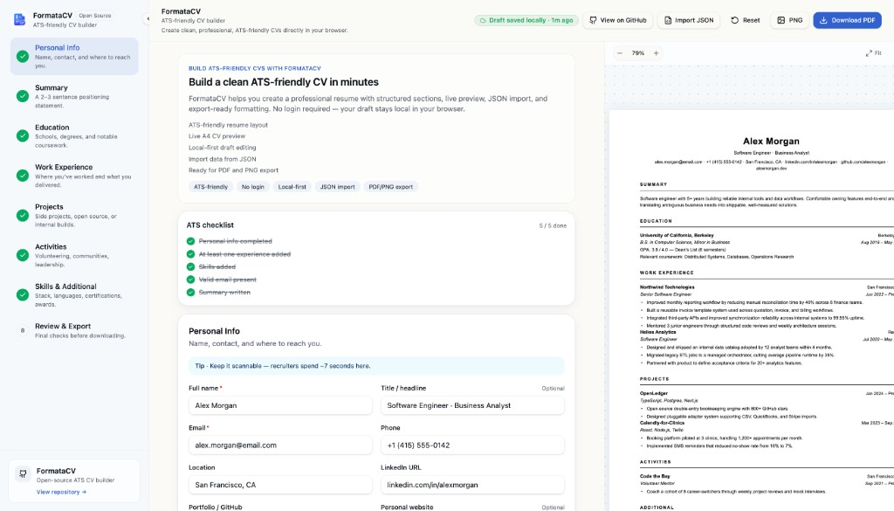

# FormataCV

<p align="center">
  
</p>

<p align="center">
  <strong>Open-source, ATS-friendly CV builder.</strong><br />
  Create clean, professional resumes directly in your browser — no login required.
</p>

<p align="center">
  <a href="https://formatacv.netlify.app">Live demo</a>
  ·
  <a href="https://github.com/radityohanif/formatacv">GitHub</a>
</p>

---

## Overview

**FormataCV** is a frontend-only resume builder designed for job seekers who want a simple, privacy-friendly way to draft and export a CV. Your data stays in the browser (local-first), updates appear instantly in an A4 live preview, and you can download a print-ready **PDF** or **PNG** when you are done.

The layout follows common ATS (Applicant Tracking System) conventions: clear headings, readable typography, standard sections, and no graphics-heavy templates that confuse parsers.

## Features

| Feature | Description |
| --- | --- |
| **ATS-friendly layout** | Single-column, text-focused design that parses well in recruiting software |
| **Live A4 preview** | See your CV update in real time as you type |
| **Guided sections** | Step-by-step flow: Personal Info → Summary → Education → Experience → Projects → Activities → Skills → Review |
| **ATS checklist** | Built-in checklist (e.g. personal info, valid email, summary) so you know basics are covered |
| **Section progress** | Sidebar shows which sections are complete |
| **Local-first storage** | Drafts auto-save to `localStorage` — no account or backend |
| **Import from JSON** | Load existing CV data via JSON import with validation |
| **Export** | Download **PDF** or **PNG** from the top bar |
| **Responsive UI** | Desktop three-column layout; mobile edit/preview tabs |

## Why ATS-friendly?

Many companies use ATS software to filter resumes before a human reads them. FormataCV helps you avoid common pitfalls:

- **Simple structure** — Standard section headings recruiters and parsers expect
- **Readable text** — No multi-column tricks or decorative elements that break parsing
- **Action-oriented content** — Hints encourage strong bullets (verb + task + result)
- **Sanity checks** — The ATS checklist nudges you toward complete contact info and a real summary

It is not a guarantee of passing every ATS, but it gives you a solid, professional baseline.

## How to use

1. Open the [live app](https://formatacv.netlify.app) or run it locally (see below).
2. Fill in each section from the left sidebar. Watch the preview on the right.
3. Use the **ATS checklist** to confirm essentials are done.
4. On **Review & Export**, do a final pass, then click **Download PDF** or **PNG**.
5. Optional: **Import JSON** to load data from another source, or **Reset** to start over.

Your draft is saved automatically in the browser. Clearing site data will remove it.

## Tech stack

- [React](https://react.dev/) 19 + [TypeScript](https://www.typescriptlang.org/)
- [Vite](https://vitejs.dev/) 7
- [TanStack Router](https://tanstack.com/router) / [TanStack Start](https://tanstack.com/start)
- [Tailwind CSS](https://tailwindcss.com/) 4
- [Radix UI](https://www.radix-ui.com/) + [shadcn/ui](https://ui.shadcn.com/) patterns
- [React Hook Form](https://react-hook-form.com/) + [Zod](https://zod.dev/)
- Export: [jsPDF](https://github.com/parallax/jsPDF) + [html2canvas](https://html2canvas.hertzen.com/)

No database or API keys are required — the app runs entirely in the client.

## Getting started

### Prerequisites

- [Node.js](https://nodejs.org/) 20+ (see `.nvmrc`)

### Install and run

```bash
git clone https://github.com/radityohanif/formatacv.git
cd formatacv
npm install
npm run dev
```

Open the URL printed in the terminal (typically `http://localhost:5173`).

### Other scripts

```bash
npm run build      # Production build → dist/client
npm run preview    # Preview production build locally
npm run lint       # ESLint
npm run format     # Prettier
```

## Environment variables

Copy `.env.example` to `.env` and adjust if needed:

| Variable | Description |
| --- | --- |
| `VITE_APP_NAME` | Product name shown in the UI |
| `VITE_SITE_URL` | Canonical / Open Graph base URL |
| `VITE_REPOSITORY_URL` | GitHub repository link in the app |

No secrets are required.

## Deploy to Netlify

1. Connect this repository to [Netlify](https://www.netlify.com/).
2. Build settings:
   - **Build command:** `npm run build`
   - **Publish directory:** `dist/client`
   - **Node version:** `20`
3. Optionally set the `VITE_*` variables in the Netlify UI.
4. Deploy.

SPA routing and security headers are configured in `netlify.toml` and `public/_redirects`.

### Social preview image

Add a **1200×630** image at `public/og-image.png` for richer link previews when sharing the site.

## Project structure (high level)

```
src/
  components/cv/   # Forms, preview, sidebar, export UI
  data/            # CV schema, sample data, section metadata
  hooks/           # Local storage persistence
  lib/             # Export, validation, JSON import, SEO
  routes/          # App pages
docs/
  screenshot.png   # README hero image
```

## Contributing

Issues and pull requests are welcome on [GitHub](https://github.com/radityohanif/formatacv). For larger changes, open an issue first to discuss the approach.

## License

Open source — see the repository for license details.
